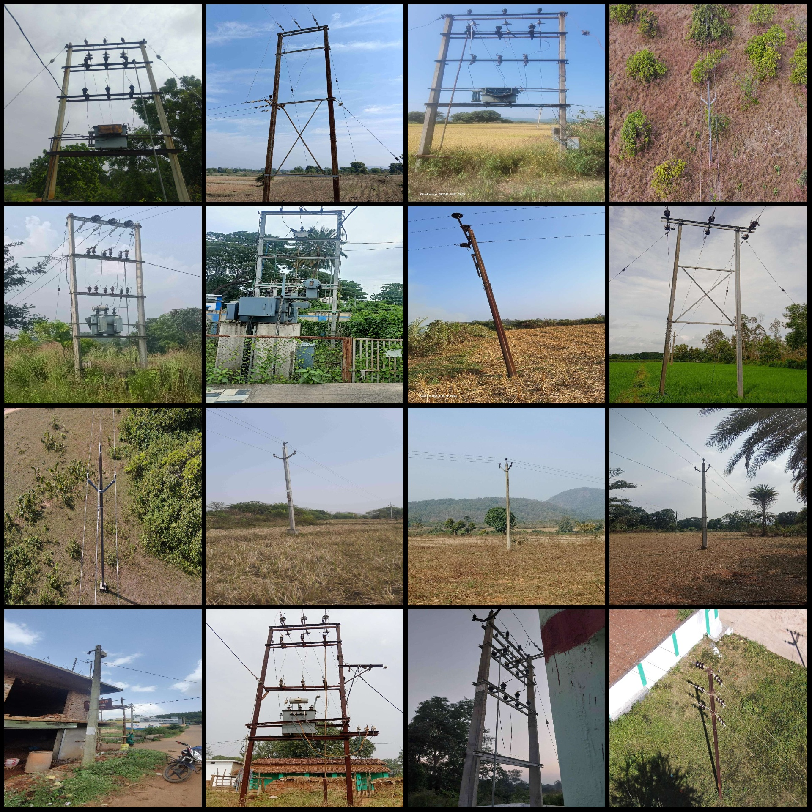
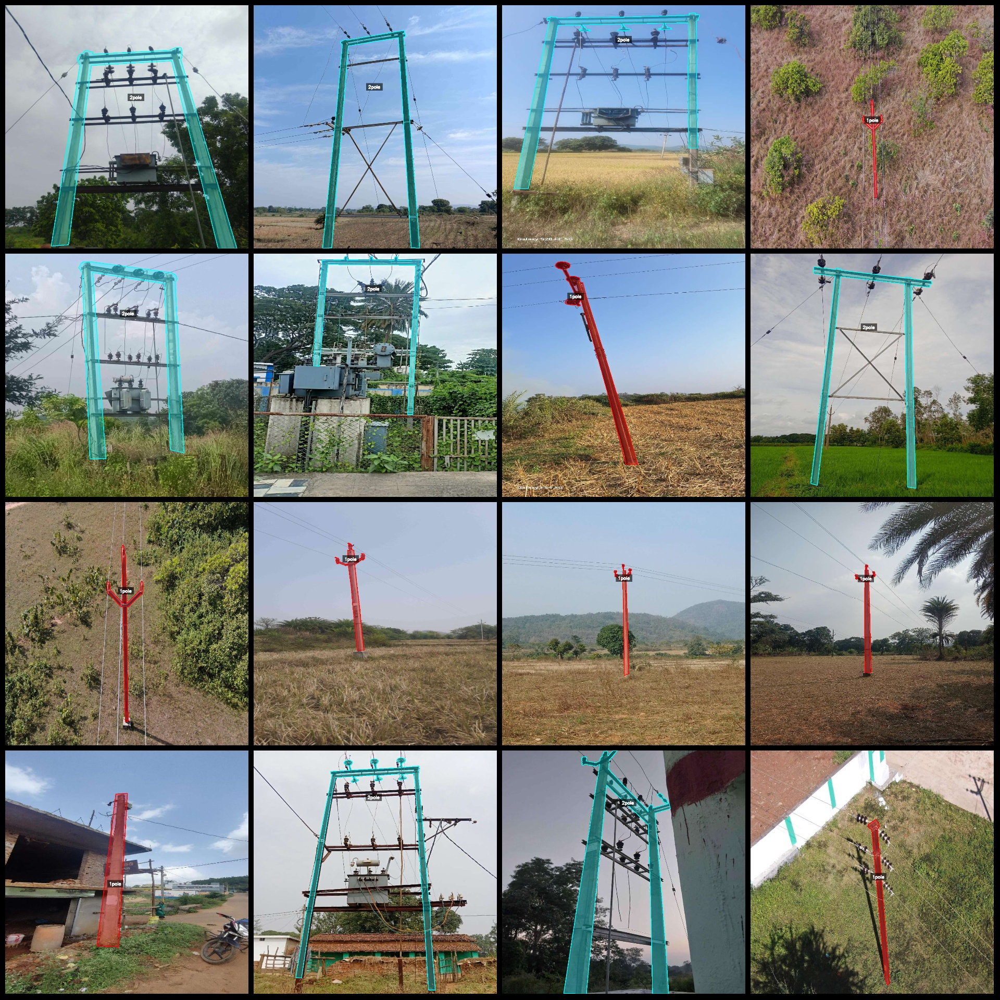
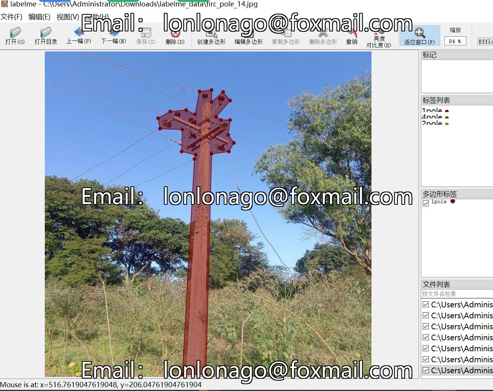

# Electric Power Scene Dataset: Pole Type Identification and Segmentation in labelme format

## Dataset Format: labelme (without mask files, only include jpg images and corresponding json files)

- Number of images (JPG file count): 4707
- Number of annotations (json file count): 4707
- Number of categories: 9
- Annotation categories: ["1pole", "2pole", "4pole", "npole", "wall", "car", "tree", "other", "3pole"]

Each category has the following number of bounding boxes:
- 1pole (single pole structure pole) count = 3238
- 2pole count = 1457
- 4pole count = 364
- npole count = 153
- wall count = 88
- car count = 12
- tree count = 104
- other count = 41
- 3pole count = 35

Total bounding box count: 5492

Used annotation tool: labelme=5.5.0
Repository location: firc-dataset
Image resolution: 1024x1024
Annotation rules: Polygons are drawn for each category
Important note: The dataset can be opened and edited using labelme, but the json dataset needs to be converted into either mask or Yolo or COCO format for semantic segmentation or instance segmentation.
Special declaration: This dataset does not guarantee any accuracy in training models or weight files.

**Image Preview:**

**Annotation Example:**

**Annotation Drawing Results:**

[Insert image with polygons drawn for each category]

**Labelme Edited Image Example:**

## Images

Here is a pay link on Stripe ( https://buy.stripe.com/3cs8yP7sY87d0vu9AB ). Please contact me lonlonago@foxmail.com after funding $89, and I will send you a complete data files , thank you!

